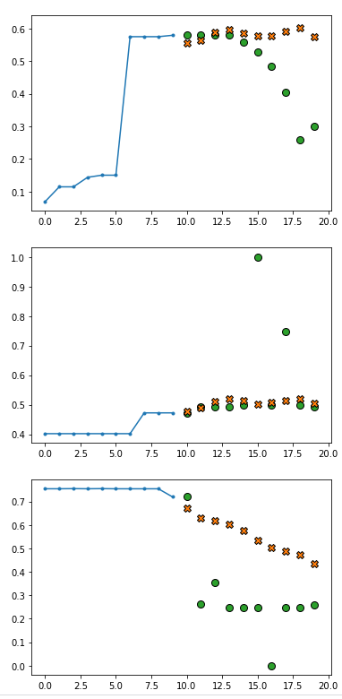
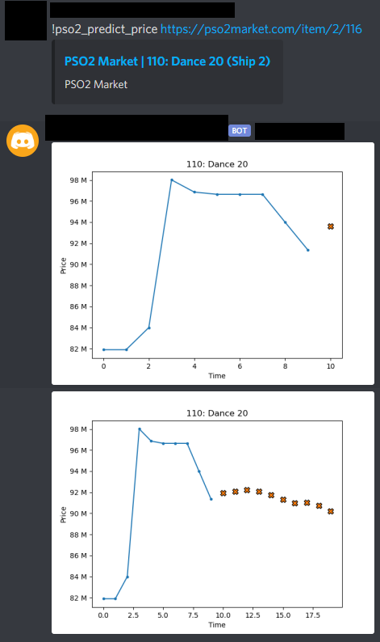

# pso2_visiphone_ml

Use Machine learning to predict price of an item in Phantasy Star Online: 2

#### Green are true values and X are predictions

### Integration with discord as a bot

### Note: this is just a foundation for future work

## Anaylsis of data, preprocessing data and building the models

`
AnalysisAndBuild.ipynb
`

## Setup dependencies (highly suggest creating a virtual environment)

`
pip install -r requirements.txt
`

## Setup discord bot for usage on live data 

### Pulls from pso2market and predicts the next prices and uses GRU model

#### Works fine running only on cpu since models are not too complex

### Setup
`
set your discord token in pso2_discord.py
TOKEN = 'SET_YOUR_DISCORD_TOKEN_HERE'
`

Then run the discord bot by typing in the command line:

`
python pso2_discord.py
`

## Special thanks to pso2market.com (u/Miyanomi / Laly#0001) for providing a ton of data on the pso2 market

